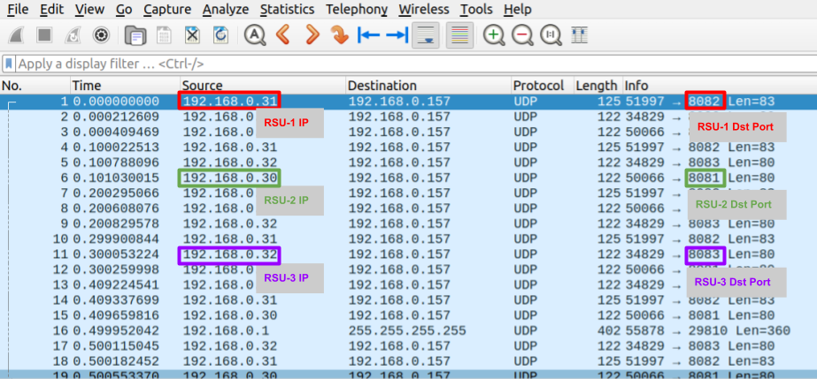

# C-V2X Testing
NET Lab methods for RSU performance testing.

---
---
## Part 1: Requirements
---
### Hardware
* [Mini-Circuits ZTMN-0695B-S](https://www.minicircuits.com/pdfs/ZTMN-0695B_Datasheet.pdf)
* Any assortment of COTS C-V2X Equipment
    * In our experiments, we used 3-4 RSUs and a single OBU
* SMA adapters, RF cables, splitters, etc.
* Spectrum/signal analyzer (we used [one of these](https://www.tek.com/en/products/spectrum-analyzers/rsa500))
* Where performance requirements demand it, two separate RF-isolation boxes
---
### Software
* [Python](https://www.python.org/)
* [Wireshark](https://www.wireshark.org/)
---
### `static_att` Measurements
(Certain libraries are required for this step; please consult the [Python Libraries](#python-libraries "Goto Python Libraries") section before trying to perform this step.)

In order for the attenuation values to be equal across receiving devices, you need to take measurements of the total static attenuation between the transmitters and the receivers while the dynamic attenuation is set to 0. To make this easy, you can simply edit and run the following file:

In `resource/clear_mesh.py`, edit the following line with the IPv4 ip address of the Mini-Circuits ZTMN-0695B-S.
```python
ip_address = '192.168.0.1'
```
then run it using the command
```bash
python3 resources/clear_mesh.py
```
This should set the dynamic attenuation between each and every link to 0. If you have everything hooked up on RF cables, though, you will still get some static attenuation from the RF cables, the mesh, and any splitters you are using. What you need to do is take measurements using something like a spectrum analyzer at the receiving end of _each_ cable to measure how attenuated the transmitted signal is compared to coming out of the sending device. Record these static attenuation values for each receiver; we will refer to these as `static_att` measurements later on in this readme.

---
---
## Part 2: Repository Setup
---
### Python Libraries
(If you are familiar with things like virtual environments, go ahead and just install from requirements.txt (make sure your environment name ends in `-env`). If you aren't, go ahead and unfold the following section for instructions on how to do that.) 
<details>
    <summary>:point_down: Click Here</summary>
In order to run the files in this repo, you will need certain python libraries installed. This section walks you through doing this in a virtual environment. For those who are are already confident in creating their venv or who just want to add the lkibraries to their machine, you can just jump to step 3.

**0. Make sure you have Python's virtual environment library**
```bash
pip install virtualenv
```
This is a super useful library, and you can read more about it [here](https://www.freecodecamp.org/news/how-to-setup-virtual-environments-in-python/).

**1. Create your virtual environment**
```bash
python3 -m venv <name>env
```
_Please make sure that your virtual envornment name ends with `-env` if you intend to develop on Git, or else add it to the `.gitignore` file!_

**2. Activate your virtual environment**
```bash
source <name>env/bin/activate
```
When you are done developing on the virtual environment, you can just exit it using the terminal command 
```bash
deactivate
```

**3. Install the required python libraries**
```bash
pip install -r requirements.txt
```
This should install all the libraries needed. If you are not using a virtual enviroment, they will be installed to your whole python environment.

The key libraries we need to access are
* [Pyshark](https://pypi.org/project/pyshark/)
* [Requests](https://docs.python-requests.org/en/latest/index.html)
* [YAML](https://python.land/data-processing/python-yaml)
</details>

---
### Build the Code

Run the following command to setup your folder:
```bash
python3 build.py
```
This will perform several functions, primarily giving you some blank folders to store data and results as well as creating an untracked `.yml` file that will be crucial for the testing.

---
### Format the .yaml File
The resulting `cv2x.yaml` file from the previous step has multiple values that need to be initialized for your particular experimental setup. They are the following:
* **host_ip**: The IPv4 ip address of the computer that will be running the experiments.
* **mesh_ip**: The IPv4 ip address of the Mini-Circuits ZTMN-0695B-S
* **static_mesh_ports**: You should have one or more devices that are set as static transmitters (or receivers) that work opposite the RSUs; write down in Python list format the ports on the attenuator mesh that these are plugged into. _For example:_ `['A', 'B']`
* **attenuations**: A list of real-number attenuation values you wish to test. When the script is run, each of these values will be applied to each RF link that is being tested._For example:_ `[90, 100, 105, 107, 109, 111, 113, 115]`
    * You might remember earlier how we needed the [`static_att` Measurements](#staticatt-measurements) - what ultimately happens is that, on each link, for each final attenuation value from this list, we tell the attenuator mesh to apply a dynamic attenuation equal to `(list_val - static_val)`
* **trial_length**: This is an easy one ;) just put the trial length in seconds. Each attenuation in the above list will be tested for this time duration.
* **wireshark_interface**: This is whichever interface on Wireshark you use to receive the forwarded packets. If you are connected via ethernet, it probably runs on `eth0`.

In addition to each of these hyperparamters, you need to create a yaml object for each COTS C-V2X device that will be connected via Ethernet and receiving packets (typically, these are the RSUs). In the `RSU DICT` setion, in the `rsus:` group, add the following for each RSU (or other device) used for the experiments:
```yaml
# Below the line that says "rsus:"
    <rsu_label>:
        ip: <IPv4 ip address of RSU>
        src_port: <src port at RSU>
        dst_port: <destination port at host>
        mesh_port: <A-F single character on mesh ports>
        att_offset: <attenuation offset for RSU (float value)>
```
That last value, the attenuation offset, comes from the list you previoulsy gathered in the [`static_att` Measurements](#staticatt-measurements) section.

As for the other elements, you can gather those from a brief live capture. After following the steps in [`static_att` Measurements](#staticatt-measurements), you should have a strong connection between your transmitter and receivers. If you open up Wireshark and look for UDP packets coming in, especially if you kow the IP address of the senders, it should be easy. Look for the information like in the photo below:


And lastly, the `mesh_port` is determined by which SMA port on the Mini-Circuits ZTMN-0695B-S the device is connected to. See the photo below:


---
---
## Part 3: Running the Code
One last part of setup might be to allow your account to run wireshark while not in `sudo` mode (if on linux). In order to do this, you can safely follow the instructions provided by Wireshark:


Once you have done all of the above setup, you should be ready to run the code!

Run the following command,
```bash
python3 live_capture.py
```

What this will do is run multiple packet captures, each for the duration set by you in `cv2x.yml::trial_length`; in each trial, the attenuation between the transmitter(s) and all the individual receivers will be set to an equal value (using our nifty `static_att` measurements) and kept there for the entire trial duration. The program automatically starts each trial after the previous one ends (you can keep track of its progress in the terminal). Please allow about 10 seconds between trial initialization and trial run for setup.

### Deliverables
After the Python code has been run, you can expect to have the following:
* All of the packet capture files for your records and further analysis (look for this in the newly created `Packet_Captures/<date>/` folder).
* Summaries files for each of the RSUs for each trial(look for this in the newly created `Results/<date>/` folder).
* A Matplotlib plot for each RSU individually and collectively to see visually how each RSU performed (look for this in the newly created `Results/<date>/` folder). 
    * Here is an example image:
    

---
---
## Thank You!
A lot of work has gone into this project, and it means a lot to have it reviewed and used. Please feel free to clone it and try your own modifications. Best of luck!

A big thanks to Panasonic - Cirrus for funding our work!